# Janji
Saya Muhammad Helmi Rahmadi dengan NIM 2311574 mengerjakan soal Latihan Modul 1 dalam mata kuliah Desain Pemrograman Berbasis Objek untuk keberkahanNya maka saya tidak melakukan kecurangan seperti yang telah dispesifikasikan. Aamiin.

# Deskripsi
Program ini adalah sistem manajemen petshop yang memungkinkan pengguna untuk menambah, menghapus, memperbarui, mencari, dan menampilkan data produk petshop. Program ini tersedia dalam berbagai bahasa pemrograman seperti Python, C++, Java, dan PHP.

# Alur Pogram
- Program menampilkan menu utama dengan opsi:
  - Tampilkan Data
  - Tambah Data
  - Ubah Data
  - Hapus Data
  - Cari Data
  - Keluar
- Pengguna memilih opsi dengan memasukkan perintah sesuai format yang tersedia.
- Jika pengguna memilih Tambah Data (Tambah), mereka harus memasukkan nama, kategori, dan harga produk. Data akan disimpan dengan ID yang auto increment hanya di PHP, sedangkan di bahasa lain pengguna harus memasukkan ID secara manual.
- Jika pengguna memilih Ubah Data (Ubah), program meminta ID produk yang ingin diperbarui dan memungkinkan pengguna mengganti nama, kategori, dan harga.
- Jika pengguna memilih Hapus Data (Haous), program meminta ID produk yang akan dihapus.
- Jika pengguna memilih Cari Data (Cari), mereka harus memasukkan nama produk untuk mencari data yang cocok.
- Jika pengguna memilih Tampilkan Data (Tampil), program menampilkan seluruh produk yang tersimpan.
- Jika pengguna memilih Keluar (Keluar), program akan berhenti berjalan.
  
# Dokumentasi

## **C++**
- **Tampilkan Data**  
  

- **Tambah Data**  
  

- **Ubah Data**  
  

- **Cari Data**  
  

- **Hapus Data**  
  

---

## **Python**
- **Tampilkan Data**  
  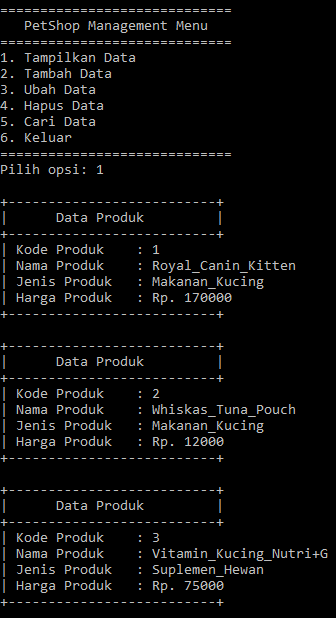

- **Tambah & Ubah Data**  
  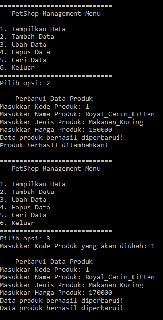

- **Keluar Data**  
  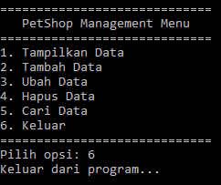

- **Cari & Hapus Data**  
  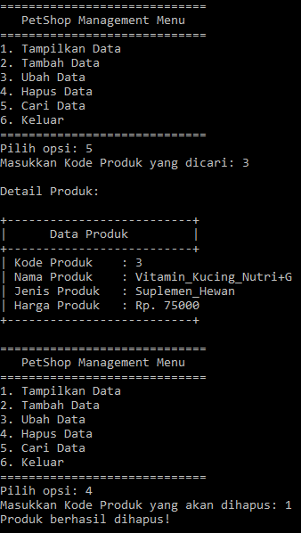

---

## **Java**
- **Tampilkan Data**  
  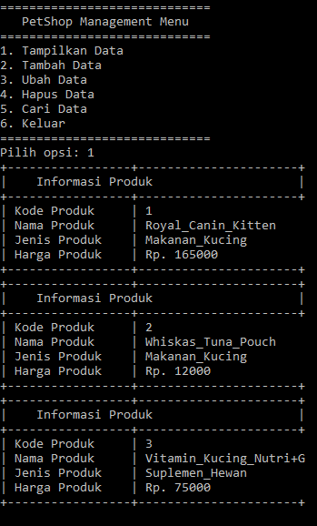

- **Tambah & Ubah Data**  
  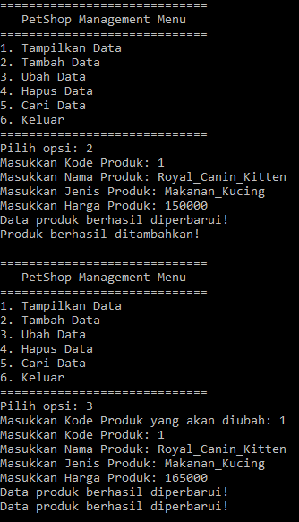

- **Keluar Data**  
  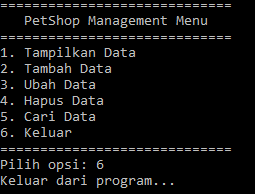

- **Cari & Hapus Data**  
  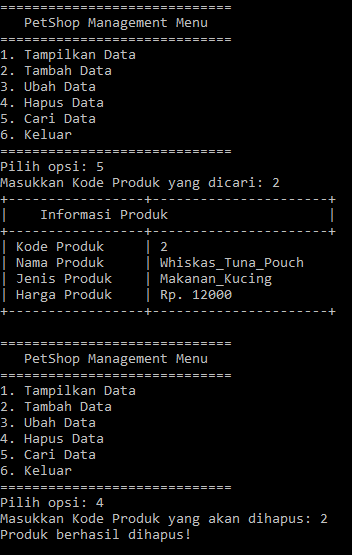

---

## **PHP**
- **Tambah Data**  
  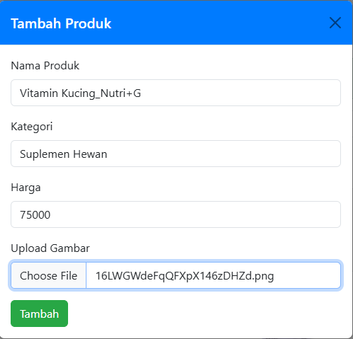  
  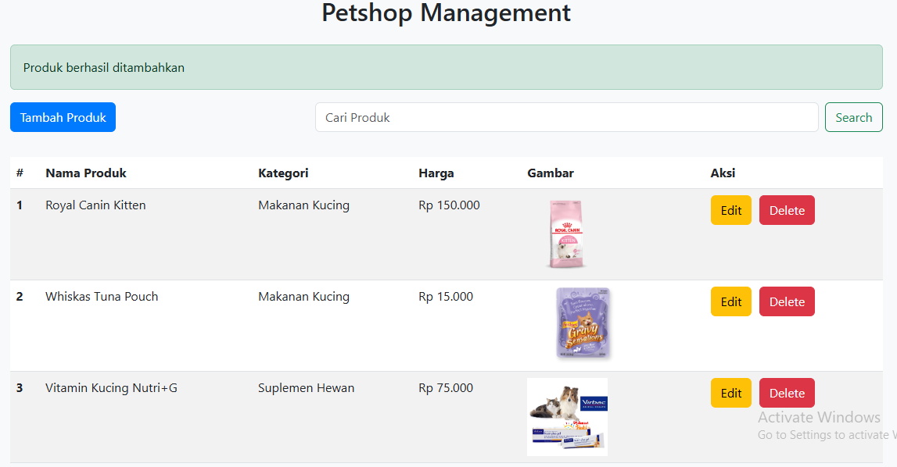

- **Ubah Data**  
  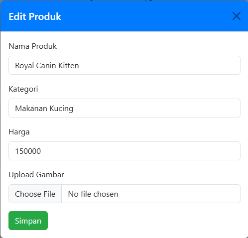  
  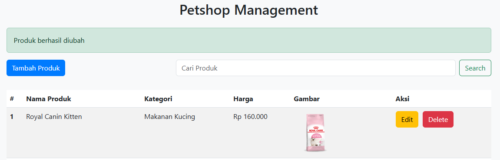

- **Cari Data**  
  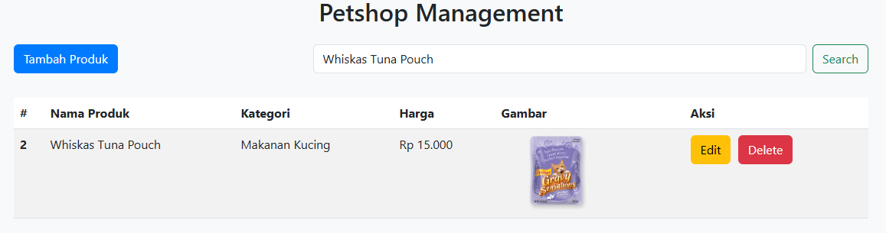

- **Hapus Data**  
  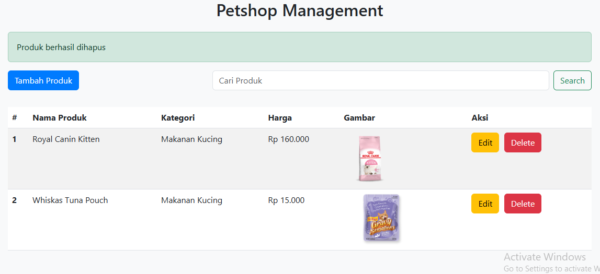

